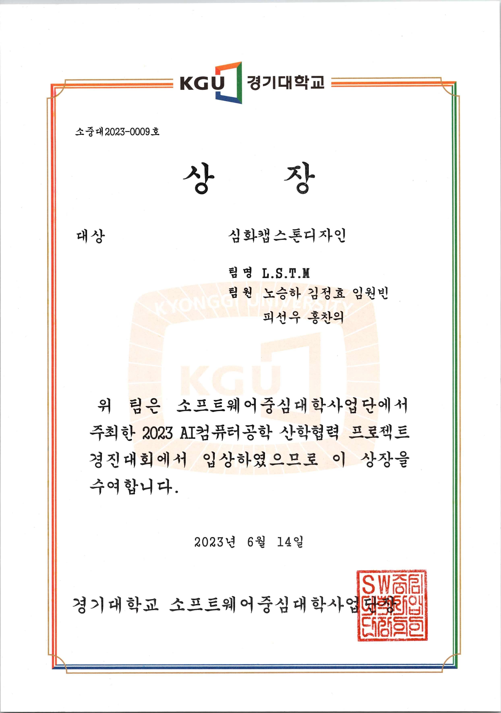

# Sunwoo Pi  

M.S. in Computer Science, Kyonggi University

 

<h3 align="center">💻 &nbsp Tech Stack &nbsp 💻</h3>

  </a>&nbsp
  </a>&nbsp
  </a>&nbsp
  </a>
    
  </a>&nbsp
  </a>
    
  </a>&nbsp
  </a>&nbsp
  </a>&nbsp
  </a>&nbsp
  </a>
    
  </a>&nbsp
  </a>

 

<h3 align="center">🏢 &nbsp Experience &nbsp 🏢</h3>

B.S, Computer Engineering, Kyonggi Univ. (Mar. 2018 - Feb. 2024) 
AI R&D Internship, (주)헬스허브 (Jul. 2023 - Aug. 2023) 
2023 SW인재 페스티벌 경기대학교 대표 (Nov. 2nd 2023 - Nov. 4th 2023) 
AI R&D Internship, (주)Visualsyn(비주얼신) (Oct. 2023 - Dec. 2023) 
K-SW Square Winter Program, Student Intership, Purdue Univ. (Dec. 2023 - Feb. 2024) 
M.S, Computer Science, Kyonggi Univ. (Mar. 2024 - )

 

<h3 align="center">📰 &nbsp Papers &nbsp 📰</h3>

<h4 align="center" style="font-weight: 700;">Domestic Conference</h4>

피선우, 이병대 “딥러닝과 앙상블 기법을 이용한 무릎 골관절염 중증도 자동 분류”  한국인터넷정보학회 춘계학술발표대회, 2023  
홍찬의, 김정효, 노승하, 임원빈, 피선우, 김상진 “인공지능 기반의 스마트 육아 어플리케이션 시스템 연구 개발” 한국정보기술학회 하계종합학술대회 및 대학생논문경진대회, 2023  
박명수, 피선우, 이병대 “영상의학 판독소견서 해석을 위한 합성 데이터 기반
초거대 언어 모델 개발 및 평가” 한국인터넷정보학회 추계학술발표대회, 2024  
권지윤, 노승하, 피선우, 이병대 "프롬프트 기반 딥러닝 모델을 활용한 흉부 방사선 영상 카테터 세그멘테이션 모델" 한국인터넷정보학회 춘계학술발표대회, 2025

<h4 align="center" style="font-weight: 700;">International Conference</h4>

Jeonghyo Kim, Seungha Noh, Sunwoo Pi, Wonbeen Im, Chanui Hong, Sangjin Kim "An Algorithm based on Infant Abnormal Posture Detection through AI Pose Estimation" 18th Asia Pacific International Conference on Information Science and Technology (APIC-IST), 2023  
Sun-Woo Pi, Myeong-Soo Park, Byoung-Dai Lee "Enhancing Radiology Report Interpretation with Large-Scale Language Models: A Two-Stage Fine-Tuning Approach" Proceedings of the 27th International Conference on Advanced Communications Technology (ICACT), 2025  
Sunwoo Pi, Seungha Noh, Junhyeon Sim, Byoung-Dai Lee "Multi-Slice Feature Fusion for Coronary Artery Calcification Segmentation in CT Imaging" 20th Asia Pacific International Conference on Information Science and Technology (APIC-IST), 2025  
Seungha Noh, Sunwoo Pi, Junhyeon Sim, Byoung-Dai Lee "Text-Image Similarity-Guided Prompt Automation for Ultrasound Image Segmentation" 20th Asia Pacific International Conference on Information Science and Technology (APIC-IST), 2025

<h4 align="center" style="font-weight: 700;">International Journals</h4>

Sun-Woo Pi, Byoung-Dai Lee, Mu Sook Lee, and Hae Jeong Lee “Ensemble Deep Learning Networks for Automatic Grading of Osteoarthritis in X-Ray Images of Knees” Scientific Reports, 13(22887), 2023 

 

<h3 align="center">🏆 &nbsp Awards &nbsp 🏆</h3>

| X |  |  |
|:--:|:--:|:--:|
| **NADO MAKER SPACE 인공지능 데이터 구축 해커톤 🏆 5th place (결선) (Jan. 2023)** | **경기대학교 AI컴퓨터공학 산학협력 프로젝트 경진대회 🥇 대상 (Jun. 2023)** | **경기대학교 SW상상기업 프로그램 경진대회 🏆 우수 사업계획서상 (Aug. 2023)** |

|  |  |
|:--:|:--:|
| **경기대학교 SW상상기업 프로그램 경진대회 🥈 우수상 (Nov. 2023)** | **과학기술정보통신부 공개SW 개발자대회 🥉 큐브리드 대표상(동상) (Dec. 2023)** |

 

<h3 align="center">📜 &nbsp Certificate &nbsp 📜</h3>

SQL Developer(SQLD) Certificate (Oct. 2021) 
정보처리기사 Certificate (Nov. 2023) 
TOPCIT Lv.3 Certificate (Nov. 2023) 
<a href="assets/IITP Korean Software Square Winter 2024 Program_Certificate of Merit.jpg">IITP Korean Software Square Winter 2024 Program Certificate of Merit (Feb. 2024)</a> 
<a href="assets/2024 스마일게이트 퓨처랩 AI 서비스 위클리톤_인증서.jpg">2024 스마일게이트 퓨처랩 AI 서비스 위클리톤 Certificate (Jul. 2024)</a> 

 

<h3 align="center">🌈 &nbsp Follow Me &nbsp 🌈</h3>

  &nbsp
  

 

<h3 align="center">👩‍💻 &nbsp My GitHub Stats &nbsp 👩‍💻</h3>

  
  
  

<!--
**sunwxxpi/sunwxxpi** is a ✨ _special_ ✨ repository because its `README.md` (this file) appears on your GitHub profile.

Here are some ideas to get you started:

- 🔭 I’m currently working on ...
- 🌱 I’m currently learning ...
- 👯 I’m looking to collaborate on ...
- 🤔 I’m looking for help with ...
- 💬 Ask me about ...
- 📫 How to reach me: ...
- 😄 Pronouns: ...
- ⚡ Fun fact: ...
-->
